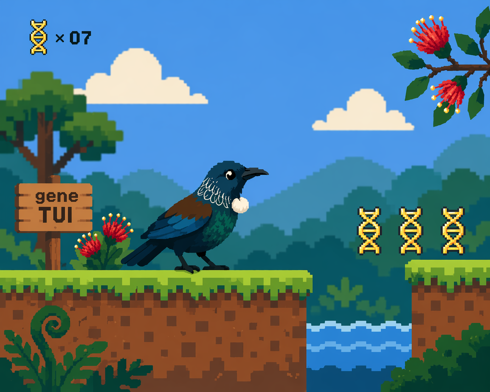

# genetui

<p align="center">
  
</p>

A fast terminal-based genome research tool written in Rust, with a live-synced browser extension for publication-ready figures and higher quality visualisations.

## Features

- **TUI genome browser** — six-frame translation, stop codons, coverage tracks, plasmid maps
- **WASM web extension** — opens alongside the TUI; syncs the viewport in real time via WebSocket
- **Circular genome maps** — sliding-window gene-density heatmaps per strand, GC skew, optional plasmid maps; clickable to navigate, draggable "you are here" arc
- **Custom gene plot** — Pyodide + dna_features_viewer renders publication-quality figures directly in the browser, no server required
- **Protein structure viewer** — fold any selected gene with `f` (minifold); 3Dmol.js panel appears automatically, coloured by pLDDT
- **Six-frame translation** — correct frame assignment for both strands, stop codons as tick marks, matching between TUI and browser views

## Usage

```
genetui <genome.gbk|fasta> [options]

Options:
  --pdbs <dir>          Directory of pre-computed PDB files
  --minifold_mlx <dir>  Path to minifold_mlx for local folding
  --bam <file>          BAM/SAM/CRAM for coverage track
  --web                 Open browser companion (default port 7890)
```

### Key bindings

| Key | Action |
|-----|--------|
| `←` `→` / `h` `l` | Pan |
| `↑` `↓` / `j` `k` | Zoom |
| `f` | Fold selected gene |
| `d` | Toggle display panels |
| `Esc` | Close protein panel |

### Browser extension (WASM)

The browser opens at `http://localhost:7890`. It shows:
- **Synced browser** — live SVG track mirroring (and independently navigable from) the TUI
- **Custom gene plot** — auto-renders with dna_features_viewer when scrolling stops; export SVG or PNG at 600 dpi
- **Structure viewer** — appears when a protein is folded; supports pLDDT, spectrum, surface, stick, and sphere styles; PNG export with optional transparent background

## Building

```
cargo build --release
```

Requires Rust 1.70+. The `rust-htslib` dependency needs `htslib` headers (`brew install htslib` on macOS).

## Citation

If you use genetui in your research, please cite:

> Ardern, Z. (2026). *genetui: a terminal-based genome browser with live browser extension* [Computer software]. GitHub. https://github.com/ZacharyArdern/genetui

BibTeX:

```bibtex
@software{ardern2026genetui,
  author  = {Ardern, Zachary},
  title   = {genetui: a terminal-based genome browser with live browser extension},
  year    = {2026},
  url     = {https://github.com/ZacharyArdern/genetui}
}
```

## License

MIT — see [LICENSE](LICENSE).

## Key dependencies & acknowledgements

| Component | Library / Tool | Notes |
|-----------|---------------|-------|
| TUI rendering | [ratatui](https://github.com/ratatui-org/ratatui) | Rust terminal UI framework |
| Genome parsing | [gb-io](https://github.com/dlesl/gb-io) | GenBank / FASTA parsing |
| BAM/CRAM support | [rust-htslib](https://github.com/rust-bio/rust-htslib) | HTSlib bindings for Rust |
| Web server | [axum](https://github.com/tokio-rs/axum) + [tokio](https://tokio.rs) | Async WebSocket + HTTP |
| Custom gene plot | [dna_features_viewer](https://github.com/Edinburgh-Genome-Foundry/DnaFeaturesViewer) | Publication-quality genomic figures (Python, runs via Pyodide) |
| Python in browser | [Pyodide](https://pyodide.org) | CPython compiled to WASM; runs dna_features_viewer client-side |
| Structure viewer | [3Dmol.js](https://3dmol.csb.pitt.edu) | WebGL molecular visualisation |
| Local protein folding | [minifold-mlx](https://github.com/ZacharyArdern/MiniFold-MLX/) | Lightweight folding based on [MiniFold](https://github.com/EricAlcaide/MiniFold) by Jeremy Wohlwend & Eric Alcaide; MLX port for Apple Silicon |
| PNG rendering | [image](https://github.com/image-rs/image) + [base64](https://github.com/marshallpierce/rust-base64) | Framebuffer→PNG conversion for Kitty terminal graphics protocol |
| Parallel computation | [rayon](https://github.com/rayon-rs/rayon) | Parallel sliding-window density and GC-skew calculations |
